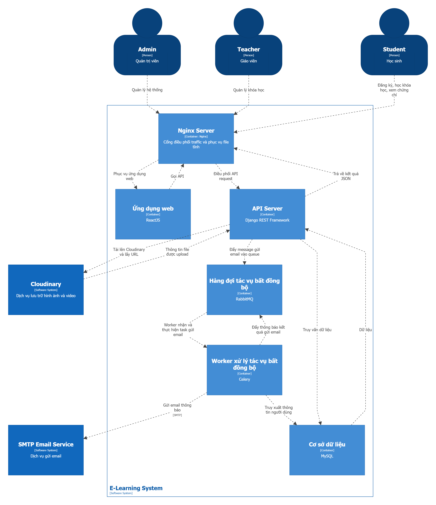

# Hệ thông học trực tuyến E-Learning System

## Mô tả

E-Learning System là một nền tảng học trực tuyến cho phép người dùng truy cập vào các khóa học, tài liệu học tập một cách dễ dàng và tiện lợi. Hệ thống hỗ trợ quản lý khóa học, bài giảng, bài tập và đánh giá kết quả học tập.

## Thành viên nhóm

| MSSV | Họ tên | Vai trò |
| ------ | -------- | --------- |
| 2351010158 | Ngàn Thành Phú | Leader, Backend Developer |
| 2351010182 | Lê Văn Quý | Frontend Developer, Tester |
| 2351050011 | Lê Hoàng Thái Bảo | Frontend Developer, DevOps |
| 2351050010 | Nguyễn Trường Bách | Frontend Developer, DevOps |

## Công nghệ sử dụng

- Backend: Django
- Frontend: React
- Database: MySQL
- Message Queue: RabbitMQ
- Container: Docker + Docker Compose

## Kiến trúc

Hệ thống được thiết kế theo kiến trúc Layered Architecture nhằm tách biệt các thành phần và đảm bảo tính mở rộng, bảo trì dễ dàng.



## Cài đặt và chạy

### Yêu cầu

- Docker Desktop
- Git

### Chạy với Docker Compose

*LƯU Ý: Thiết lập biến môi trường trước khi chạy bằng Docker Compose*

```bash
git clone https://github.com/nganthanhphu/eLearningSystem.git
cd eLearningSystem
docker-compose up -d
```

### Truy cập

- Frontend: <http://localhost>
- Backend API: <http://localhost/api>
- RabbitMQ Management: <http://localhost:15672>

## Demo

Đang cập nhật...

## Tài liệu

- [ADRs](docs/adrs/)
- [API Documentation](docs/api/)
- [C4 Diagrams](docs/architecture/)
- [Sequence Diagrams](docs/sequence/)
- [UseCase Diagrams](docs/usecase/)
- [NFRs](docs/requirements.md)
