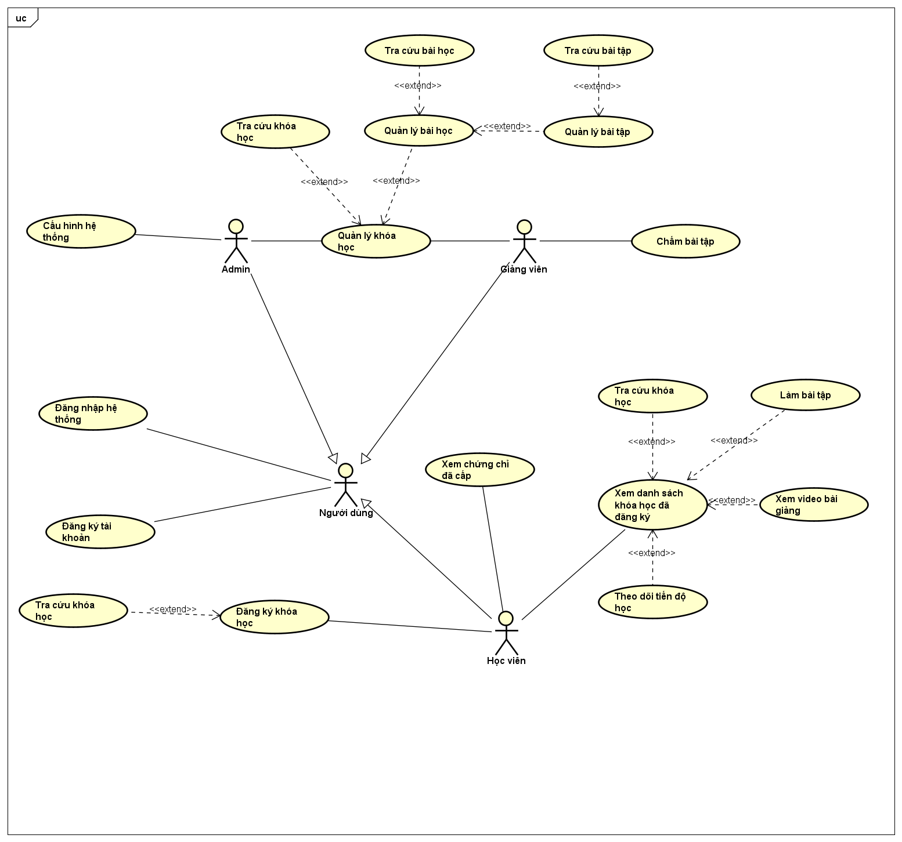

# Phân tích yêu cầu

## Use case diagram

## API endpoints
| Phương thức | Endpoint | Chức năng |
| :--- | :--- | :--- |
| POST | /o/token | Người dùng đăng nhập  |
| POST | /users/ | Tạo mới tài khoản người dùng  |
| GET | /users/current-user/ | Lấy thông tin của người dùng đang đăng nhập  |
| PATCH | /users/current-user/ | Cập nhật một phần thông tin của người dùng  |
| GET | /users/{id}/ | Lấy thông tin của một người dùng  |
| GET | /courses/ | Lấy danh sách toàn bộ khóa học hiện có trên hệ thống  |
| POST | /courses/ | Tạo mới một khóa học  |
| GET | /courses/{id}/ | Lấy thông tin của một khóa học cụ thể  |
| PATCH | /courses/{id}/ | Cập nhật thông tin khóa học  |
| DELETE | /courses/{id}/ | Xóa khóa học khỏi hệ thống  |
| GET | /courses/{id}/lessons/ | Lấy danh sách tất cả các bài học thuộc về một khóa học cụ thể  |
| POST | /lessons/ | Tạo mới một bài học  |
| GET | /lessons/{id}/ | Lấy thông tin của một bài học  |
| PATCH | /lessons/{id}/ | Cập nhật thông tin bài học  |
| DELETE | /lessons/{id}/ | Xóa bài học  |
| GET | /submissions | Xem các bài tập đã nộp  |
| GET | /assignments/{id}/submissions | Xem bài tập đã nộp thuộc một bài tập  |
| POST | /submissions | Nộp bài tập  |
| GET | /submissions/{id} | Xem chi tiết một bài tập đã nộp  |
| PATCH | /submissions/{id} | Cập nhật bài tập  |
| GET | /enrollments | Xem các khóa học đã đăng ký  |
| POST | /enrollments | Đăng ký khóa học  |
| GET | /lessons/id/assignments | Lấy các bài tập trong bài học  |
| POST | /assignments | Thêm bài tập  |
| GET | /assignments/{id} | Lấy thông tin chi tiết của bài tập  |
| PATCH | /assignments/{id} | Cập nhật bài tập  |
| DELETE | /assignments/{id} | Xóa bài tập  |
| GET | /certificates | Lấy danh sách chứng chỉ  |
| GET | /certificates/{id}/ | Xem chi tiết một chứng chỉ  |

## Yêu cầu phi chức năng
1. Giao diện người dùng phải thân thiện, dễ sử dụng và tương thích với nhiều thiết bị khác nhau.
2. Hệ thống phải đảm bảo tính bảo mật, bao gồm việc mã hóa mật khẩu người dùng và phân quyền truy cập chặt chẽ.
3. Thời gian phản hồi của hệ thống ở mức chấp nhận được (dưới 2-3 giây), không yêu cầu quá nhanh.
4. Đảm bảo hệ thống có khả năng chịu lỗi và có thể khôi phục sau sự cố.